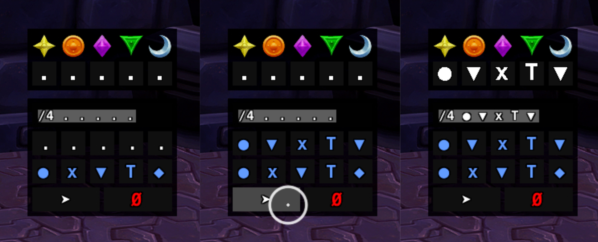

# L'Ura Helper

A World of Warcraft addon for tracking symbol sequences against raid markers during the L'Ura encounter in Midnight Falls.

## Features

### Interactive Panel
A compact button bar with 5 symbol buttons (O, X, Δ, T, ◆) and a cancel/reset button. Click symbols to build a sequence that maps to the configured raid markers. The panel is draggable and can be locked in place.

### Summary Panel
Displays the configured raid markers on the top row and the player's selected symbol sequence on the bottom row. Includes its own reset button. Also draggable and lockable.

### Panel Scaling
Both the Summary and Interactive panels can be scaled independently from 0.01× to 5× via sliders or direct numeric input in the options panel.

### Named Profiles
Create, switch, and delete named configuration profiles. Each profile stores its own marker sequence, lock/hide state, frame positions, and scale. A **Default** profile is always present and cannot be deleted.

### Configurable Marker Sequence
Remap each of the 5 symbol slots to any WoW raid marker (Star, Circle, Diamond, Triangle, Moon, Square, Cross, Skull) or set a slot to **None** to disable it.

### Import / Export
Export the current profile as a Base64-encoded string and share it with others. Importing prompts for a profile name and asks for overwrite confirmation if the name already exists.

### Options Panel
Accessible via `/lura` or the WoW Interface → AddOns menu. Provides checkboxes for Lock, Hide, and Test Mode, plus buttons for profile management, restore defaults, and import/export.

## Slash Commands

All commands use the `/lura` prefix:

| Command | Description |
|---|---|
| `/lura` | Open the options panel |
| `/lura help` | Print a summary of all slash commands |
| `/lura toggle` | Toggle panel visibility (hide/show) |
| `/lura lock` | Lock panel positions |
| `/lura unlock` | Unlock panel positions |

## Installation

1. Copy the `LUraHelper` folder into your WoW `Interface/AddOns/` directory.
2. Restart WoW or type `/reload` in chat.

## File Structure

| File | Purpose |
|---|---|
| `core.lua` | Event handling, database initialization, visibility/lock/scale logic |
| `profiles.lua` | Profile CRUD, position save/restore, UI refresh |
| `panels.lua` | Interactive and summary panel creation, sequence logic |
| `options.lua` | Options panel, slash command handler, scale sliders |
| `importexport.lua` | Base64 encoding, XML config export/import, import UI |

---

*Made by Deino for Poetic Justice - Ravencrest*
